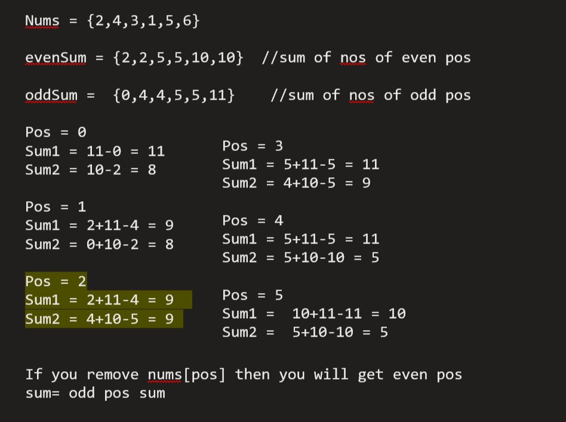

# 1664. Ways to Make a Fair Array

## [Problem Link ](https://leetcode.com/problems/ways-to-make-a-fair-array/description/)

```
You are given an integer array nums. You can choose exactly one index (0-indexed) and remove the element. Notice that the index of the elements may change after the removal.

For example, if nums = [6,1,7,4,1]:

Choosing to remove index 1 results in nums = [6,7,4,1].
Choosing to remove index 2 results in nums = [6,1,4,1].
Choosing to remove index 4 results in nums = [6,1,7,4].
An array is fair if the sum of the odd-indexed values equals the sum of the even-indexed values.

Return the number of indices that you could choose such that after the removal, nums is fair.
```


## Approach

1. Remove the element and find even odd sum ~ O(n<sup>2</sup>)
2. 



## Solution 


```c++
    class Solution {
public:
    int waysToMakeFair(vector<int>& nums) {
        
        int n= nums.size();
        int oddSum[n];
        int evenSum[n];
        oddSum[0] = 0;
        evenSum[0] = nums[0];   
        if (n>1){
            oddSum[1] = nums[1];
        }
        


        for (int i = 1; i<n; i++){
            evenSum[i] = evenSum[i-1];
            oddSum[i] = oddSum[i-1];
            if (i%2 == 0){
                evenSum[i] = evenSum[i-1] + nums[i];
            }
            else 
                {
                    oddSum[i]= oddSum[i-1]+nums[i];
                }
        }


        int count = 0;
        if( (oddSum[n-1] - oddSum[0]) == ( evenSum[n-1] - evenSum[0]) )
                count =1;
        for(int i = 1; i<n; i++){
            
            int sum1 = 0;
            int sum2 = 0;
            
            sum1 = evenSum[i-1] + oddSum[n-1] - oddSum[i];
            sum2 = oddSum[i-1] +  evenSum[n-1] - evenSum[i];;

            if (sum1 == sum2){
                count++;
            }
        }
        return count;
    }
};
```
### Time Complexity : `O(n)`


### Space Complexity : `O(n)`