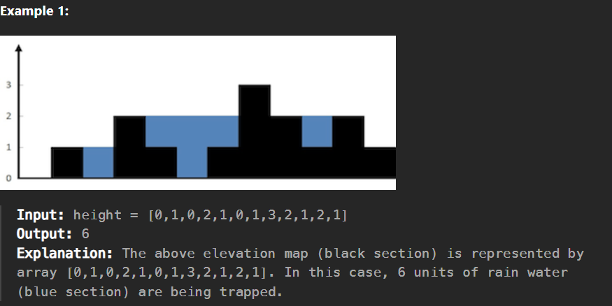

# Trapping Rain Water

## [Problem Link ](https://leetcode.com/problems/trapping-rain-water/solutions/5620351/beats-100-0ms-2-pointer-sol-with-explaination/)





## Approach

if you can find the left maximum and right maximum building of current building 
then water will be filled according to the MIN(leftMax, rightMax) 
and qty of water will be { current height - MIN(leftMax, rightMax) }


## Solution 


```c++
int trap(vector<int>& height) {
        int water=0;
        int maxi = 0;
        int leftMaxHeight[height.size()];
        int rightMaxHeight[height.size()];

        for(int i=0; i<height.size(); i++){
            maxi = max(maxi, height[i]);        // building an array for leftMax of each building 
            leftMaxHeight[i]= maxi;
        }
        maxi= 0;
        for(int i=height.size()-1; i>=0; i--){
            maxi = max(maxi,height[i]);          // building an array for rigthMax of each building 
            rightMaxHeight[i] = maxi;
        }

        for (int i = 1; i< height.size()-1; i++){

            water = water +min(leftMaxHeight[i], rightMaxHeight[i])- height[i];  //qty
        }
        return water;
    }

```
### Time Complexity : `O(n)`


### Space Complexity : `O(n)`