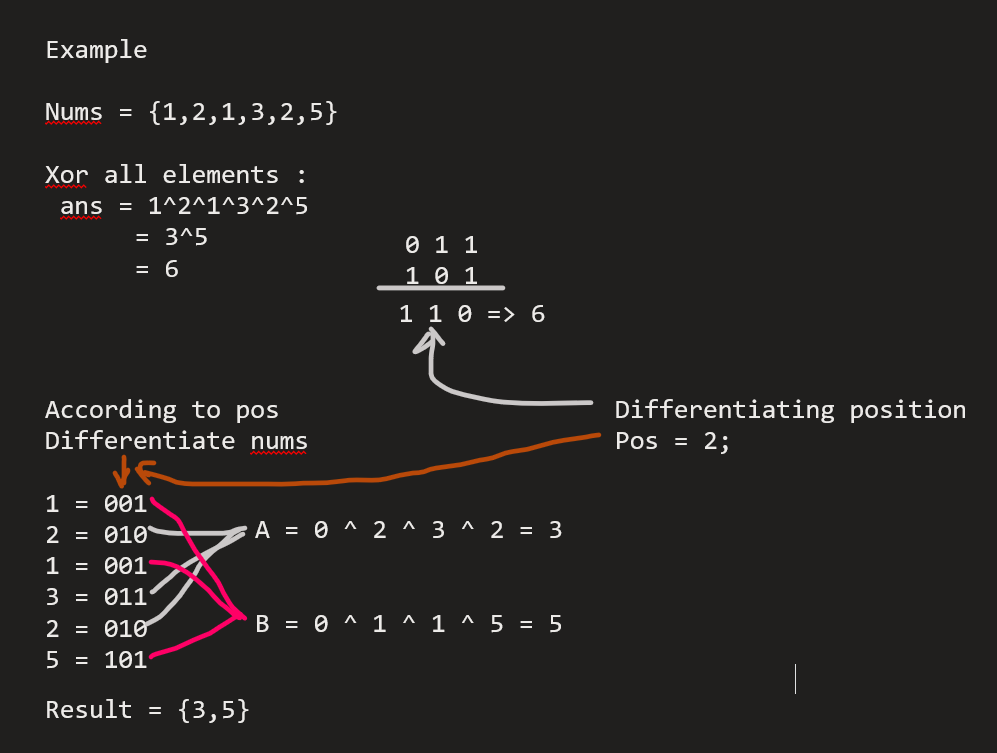

# Single Number III Repetition 2N + 2

## [Problem Link ](https://leetcode.com/problems/single-number-iii/description/)

```
Given an integer array nums, in which exactly two elements appear only once and all the other elements appear exactly twice. Find the two elements that appear only once. You can return the answer in any order.

You must write an algorithm that runs in linear runtime complexity and uses only constant extra space.

 

Example 1:

Input: nums = [1,2,1,3,2,5]
Output: [3,5]
Explanation:  [5, 3] is also a valid answer.
Example 2:

Input: nums = [-1,0]
Output: [-1,0]
```


## Approach

1. can be done by two loops find unique element
2. can be done by sorting and then find non repeting element
3. can be done by map by calculating frequency 
4. optimal approach by bit manipulation -




## Solution 


```c++
    //to find differentitating position
    int findPos( int number )
    {
        int pos =0;
        for(int i = 0; i<32; i++)
        {
            if((number&1) == 1)
            {
                pos = i;
                break;
            }
            number = number>>1;
        }
        return pos;
    }

    // to get Ith bit 
    int getIthBit(int num, int mask)
    {
        return (num & mask) != 0;
    }

    //mian function
    vector<int> singleNumber(vector<int>& nums) 
    {
        int ans = 0;
        int n = nums.size();
        int pos;
        for (int i = 0; i<n; i++){
            ans = ans ^ nums[i];
        }
        if (ans!=0)
            pos = findPos(ans);
        else return vector<int> ();

        int A = 0;
        int B = 0;
        int mask = 1<<(pos);
        for(int i = 0; i<n; i++){
            if (getIthBit(nums[i], mask)==1)
                A = A ^ nums[i];
            else 
                B = B ^ nums[i];
        }
        vector <int> result;
        result.push_back(A);
        result.push_back(B);
        return result;
    }
```
### Time Complexity : `O(n)`


### Space Complexity : `O(1)`