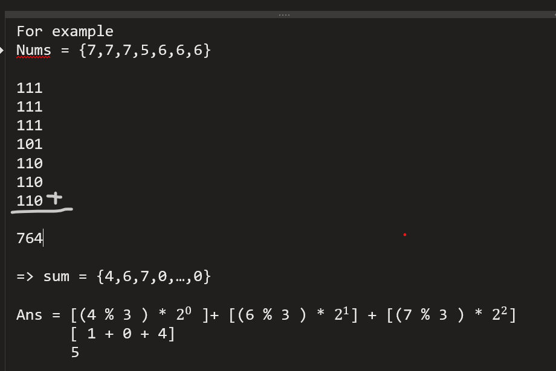

# Single Number II Repetition 3N + 1

## [Problem Link ](https://leetcode.com/problems/single-number-ii/description/)

```
Given an integer array nums where every element appears three times except for one, which appears exactly once. Find the single element and return it.

You must implement a solution with a linear runtime complexity and use only constant extra space.

 

Example 1:

Input: nums = [2,2,3,2]
Output: 3
Example 2:

Input: nums = [0,1,0,1,0,1,99]
Output: 99
```


## Approach

1. can be done by two loops find unique element
2. can be done by sorting and then find non repeting element
3. can be done by map by calculating frequency 
4. optimal approach by bit manipulation -




## Solution 


```c++
int singleNumber(vector<int>& nums) {
        int sum[32] = {0};
        int bit ;
        for (int num: nums){            //{7,7,7,5,6,6,6}
            int j=0;
            while (num != 0 && j<32)
            {
                bit = (num&1);          //(0111 & 0001 = 0001) extracting bits 
                sum[j] += bit;          // sum = {7,6,4,0,...,0}
                num>>=1;                //after extracting last bit remove last bit 
                j++;
            }
        }
        int ans = 0;
        int weight = 1;
        for (int eachSum : sum){
           
            ans += (eachSum % 3) * weight;   //7%3 = 1 , 1*2^0,  6%
            weight<<=1;
        }
        return ans;
    }

```
### Time Complexity : `O(n)`


### Space Complexity : `O(1)`