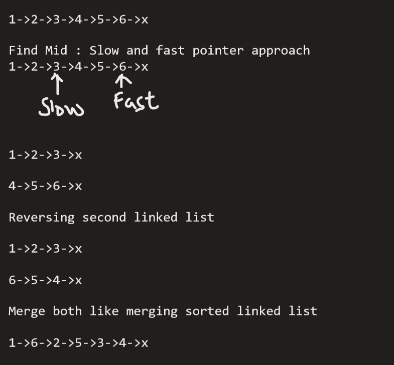

# 143. Reorder List

## [Problem Link ](https://leetcode.com/problems/reorder-list/description/)

```
Input: head = [1,2,3,4]
Output: [1,4,2,3]

Input: head = [1,2,3,4,5]
Output: [1,5,2,4,3]
```


## Approach

### 1. find Mid Reverse Second Half and merge




## Solution 


```java
/**
 * Definition for singly-linked list.
 * public class ListNode {
 *     int val;
 *     ListNode next;
 *     ListNode() {}
 *     ListNode(int val) { this.val = val; }
 *     ListNode(int val, ListNode next) { this.val = val; this.next = next; }
 * }
 */
class Solution {
    public ListNode findMid(ListNode head){
        ListNode mid = head;
        while (head.next != null && head.next.next != null){
            head = head.next.next;
            mid = mid.next;
        }
        return mid;
    }
    public ListNode reverseLL (ListNode head2){
        ListNode prev = null;
        ListNode next;

        while (head2 != null){
            next = head2.next;
            head2.next = prev;
            prev = head2;
            head2 = next;
        }
        return prev;
    }
    public ListNode mergeLL(ListNode head, ListNode head2){
        ListNode prevNode = new ListNode(-1);
        ListNode prev = prevNode;

        while(head != null && head2 != null){
            prev.next = head;
            prev = head;
            head = head.next;
            prev.next = head2;
            prev = head2;
            head2 = head2.next;
            
        }
        if (head2 == null) prev.next = head;
        if (head == null) prev.next = head2;
        return prevNode.next;
    }
    public void reorderList(ListNode head) {
        ListNode mid = findMid(head);
        ListNode cut = head;
        while(cut != mid){
            cut = cut.next; 
        }
        ListNode head2 = cut.next;
        cut.next = null;

        head2 = reverseLL(head2);
        
        head = mergeLL(head, head2);
        
    }
}
    
```
### Time Complexity : `O(n)`


### Space Complexity : `O(1)`
